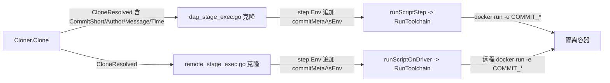

## 用户需求

参考项目现有 commit hash 的解析与传递机制，增强使其支持把更多提交元数据（提交作者、提交备注、提交时间）也注入到隔离构建容器的环境变量中，供用户在流水线 YAML 的 script 步骤里引用，且不改变、不影响项目其他功能。

## 产品概述

在现有「克隆结果 CloneResolved → 环境变量注入容器」链路上做最小增强：克隆检出时额外提取完整 Commit 对象的作者/备注/时间，并以约定命名注入到 script 步骤容器的环境变量，本地 docker 构建与远程 SSH 构建两条执行路径都覆盖。

## 核心特性

- 扩展克隆结果结构体，新增提交作者、提交备注、提交时间字段
- 克隆检出成功后通过 go-git 获取完整 Commit 对象并填充上述字段
- 在本地 docker 构建与远程 SSH 构建两种路径的 script 步骤环境变量组装处，追加 COMMIT_SHA / COMMIT_AUTHOR / COMMIT_MESSAGE / COMMIT_TIME 四个明文环境变量（字段为空则跳过，避免污染）
- 环境变量注入顺序遵循现有约定：运行参数 → 上游输出 → 流水线级变量 → 新增 commit 元数据 → job 自身 env（后者可覆盖同名键），不改变 docker run 调用方式与其它功能

## 技术栈

- 语言：Go（项目现有技术栈，不改）
- 依赖：github.com/go-git/go-git/v5（已在 go.mod，无需新增），使用其 `plumbing/object` 包解析完整 Commit
- 注入机制：复用现有 BuildVar / Driver.RunToolchain（docker run -e）链路，不新增容器调用方式

## 实现方案

### 总体策略

沿用项目既有「CloneResolved 承载克隆结果 → runParamsAsEnv/step.Env 组装 → RunToolchain 注入容器」链路，做最小化扩展：扩展数据结构、增强解析、新增一个辅助函数把 commit 元数据转成 BuildVar、在两处 script 步骤 env 组装点追加该辅助结果。

### 关键技术决策

1. **字段命名与风格**：遵循用户确认的 COMMIT_SHA 风格（全大写下划线），即 COMMIT_SHA（对齐现有 CommitShort）、COMMIT_AUTHOR、COMMIT_MESSAGE、COMMIT_TIME（RFC3339）。COMMIT_TIME 与提交时间语义一致。
2. **提交备注必须压成单行**：commit message 通常含多行换行符，而环境变量值（经 `docker run -e KEY=val` 或 `--env-file` 注入）含换行会导致 `KEY=第一行\n第二行` 被 shell 截断/解析异常。因此 `Message` 在解析时即压成单行：**用 `strings.Join(strings.Fields(c.Message), " ")` 处理**——按所有空白（含换行、连续空格、制表符）切分后空格重连，自然得到去除首尾与内部多余空白的单行字符串，避免信息丢失且对 env 安全。`Author` 取 `c.Author.Name`；`Time` 取 `c.Author.When`（`time.Time`，注入时 `Format(time.RFC3339)`）。
2. **解析位置**：在 `(*Cloner).Clone` 成功克隆/检出后，取 `head, _ := repo.Head()`，再 `commitObj, _ := repo.CommitObject(head.Hash())`。go-git 浅克隆（Depth:1）HEAD 可达，CommitObject 可用，无需改克隆策略，避免额外网络开销。解析失败（极端情况）仅留空字段，不影响既有 CommitShort 与构建。
3. **注入辅助函数**：新增 `commitMetaAsEnv(resolved *CloneResolved) []pipeline.BuildVar`，字段为空跳过，返回明文（Secret:false）BuildVar，统一复用 `pipeline.BuildVar{Key, Value, Secret:false}` 结构，与 `runParamsAsEnv` 风格一致。
4. **透传方式**：`cloneJobWorkspace` 当前仅返回 commitTag；为保持改动聚焦，注入点直接复用调用处已存在的 `resolved` 局部变量（dag_stage_exec.go 第186-201行、第486-501行作用域内已有 resolved），把 `commitMetaAsEnv(resolved)` 插在 `settings.Build.Vars` 之后、`step.Env` 之前，满足「job 自身 env 可覆盖同名」语义。remote_stage_exec.go 第88行 resolved 已在作用域，第128行处追加即可。
5. **两路径一致**：本地 dag_stage_exec.go（两处 script 注入点）与 remote_stage_exec.go（远程 SSH 路径）都追加，保证执行环境一致。

### 性能与可靠性

- CommitObject 仅一次 HEAD 解析 + 一次对象读取，开销可忽略；不引入额外克隆/拉取。
- 解析失败优雅降级（空值跳过），不阻断构建，符合项目「缓存/解析问题绝不阻断构建」基调。
- env 列表仅增加最多 4 项明文 K=V，不改变 docker run argv 结构，无命令注入面（沿用宿主 array、容器 sh -c 既有防护）。

## 实现要点（执行注意）

- 注释与日志：不得把 token/URL 写入日志（沿用现有约束）；新增元数据为明文 commit 信息，非敏感，可按既有方式注入，不登记进 Masker（非 secret）。
- 向后兼容：现有测试构造 `&CloneResolved{CommitShort: "..."}` 因新增字段为零值仍编译通过；不改动 recordCommit、commitTag、notify 等既有逻辑。
- 不改动 `internal/repocache`、`internal/ai/diff` 等无关模块。

## 架构设计

现有链路（无需引入新架构）：



## 目录结构与文件

### internal/build/cloner.go  [MODIFY]

- 目的：承载克隆结果并解析完整 commit 元数据。
- 功能：`CloneResolved` 结构体新增 `Author string`、`Message string`、`Time time.Time` 字段；`(*Cloner).Clone` 在克隆/检出后通过 `repo.Head()` + `repo.CommitObject(head.Hash())` 填充上述字段；新增 `time` 与 `plumbing/object` 导入。
- 实现要求：CommitObject 解析失败仅留空，不返回错误；`Author = c.Author.Name`；`Message = strings.Join(strings.Fields(c.Message), " ")`（**压成单行**，消除换行与多余空白，确保 env 安全）；`Time = c.Author.When`（注入时 `Format(time.RFC3339)`）；`CommitShort` 维持现有取值不变。

### internal/build/dag_stage_exec.go  [MODIFY]

- 目的：本地 docker 构建路径把 commit 元数据注入 script 步骤 env。
- 功能：新增 `commitMetaAsEnv(resolved *CloneResolved) []pipeline.BuildVar` 辅助函数；在两处 env 组装点（约第247行 runScriptJobIsolated、第538行 runBuildImageJob 前）的 `settings.Build.Vars` 之后、`step.Env` 之前追加 `commitMetaAsEnv(resolved)`。
- 实现要求：复用调用处已有 `resolved` 变量；顺序遵循现有「运行参数→上游输出→流水线变量→commit元数据→job自身env」；空字段跳过。

### internal/build/remote_stage_exec.go  [MODIFY]

- 目的：远程 SSH 构建路径同样注入 commit 元数据。
- 功能：第128行 `step.Env = append(runParamsAsEnv(...), step.Env...)` 处追加 `commitMetaAsEnv(resolved)`（resolved 在第88行作用域内）。
- 实现要求：与本地路径语义一致，保持两种执行环境对齐。

### internal/build/cloner_test.go （如存在）/ 相关测试  [NEW/可选]

- 目的：验证 CloneResolved 新字段填充与 commitMetaAsEnv 输出。
- 功能：补一个单测断言 COMMIT_AUTHOR/COMMIT_MESSAGE/COMMIT_TIME 出现在容器 env 列表（可置于 dag_stage_exec_test.go 或新增 cloner_test.go）。
- 实现要求：沿用现有 fake cloner / recordingDriver 断言模式，不破坏现有用例。

## 关键代码结构

```
// internal/build/cloner.go
type CloneResolved struct {
	CommitShort string
	Author      string // c.Author.Name
	Message     string // strings.Join(strings.Fields(c.Message), " ")，压成单行
	Time        time.Time // c.Author.When
}

// internal/build/dag_stage_exec.go
// commitMetaAsEnv 把克隆解析出的提交元数据转为明文环境变量(字段空则跳过)。
// COMMIT_SHA=CommitShort, COMMIT_AUTHOR=Author, COMMIT_MESSAGE=Message(单行), COMMIT_TIME=Time.Format(RFC3339)
func commitMetaAsEnv(resolved *CloneResolved) []pipeline.BuildVar
```